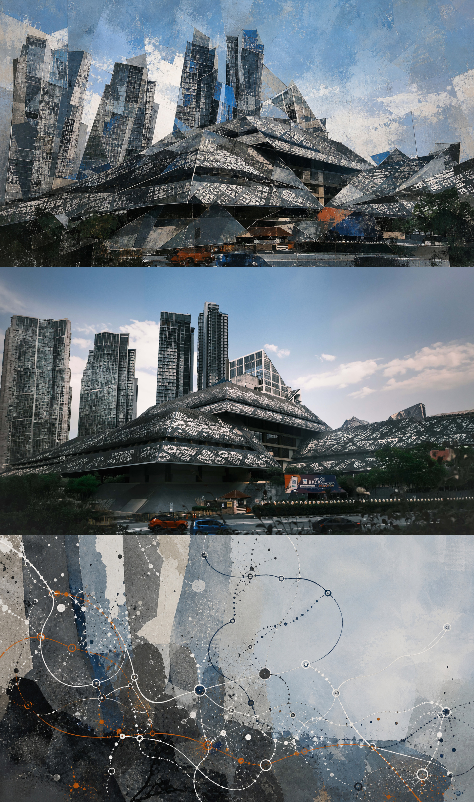
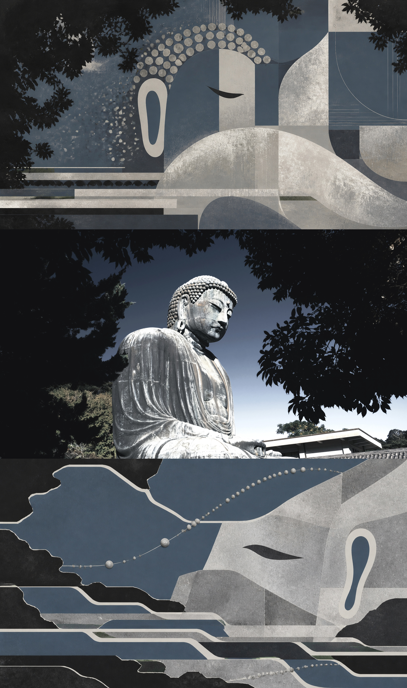

# 【S.002】Starryear-Threefold-Memory丨星年·三重记忆

One photograph, three states of memory:

1. **What I saw** — deconstructed perception
2. **What happened** — unchanged photographic evidence
3. **What stayed** — diagrammatic afterimage

## Versions

| Version | Status | Instructions | Visual references | Download |
| --- | --- | --- | --- | --- |
| **2.x** | Current | [Skill](versions/v2/SKILL.md) · [Master prompt](versions/v2/MASTER-PROMPT.md) | [8 works](versions/v2/assets/examples) | [v2.2.1 ZIP](downloads/Starryear-Threefold-Memory-v2.2.1.zip) |
| **1.0** | Legacy | [Skill](versions/v1/SKILL.md) | [10 works](versions/v1/assets/examples) | [v1.0.0 ZIP](downloads/Starryear-Threefold-Memory-v1.0.0.zip) |

The root [SKILL.md](SKILL.md) and the original download link always point to the latest stable version. Version 1 remains available as a preserved archive.

## Visual references

| Version 2 | Version 1 |
| --- | --- |
|  |  |

Reference images demonstrate the method only. Do not reuse their subjects, compositions, palettes, routes, or symbols unless the user's source photograph independently supports them.

© Starryear. All source photographs are original and may not be reused without permission.
